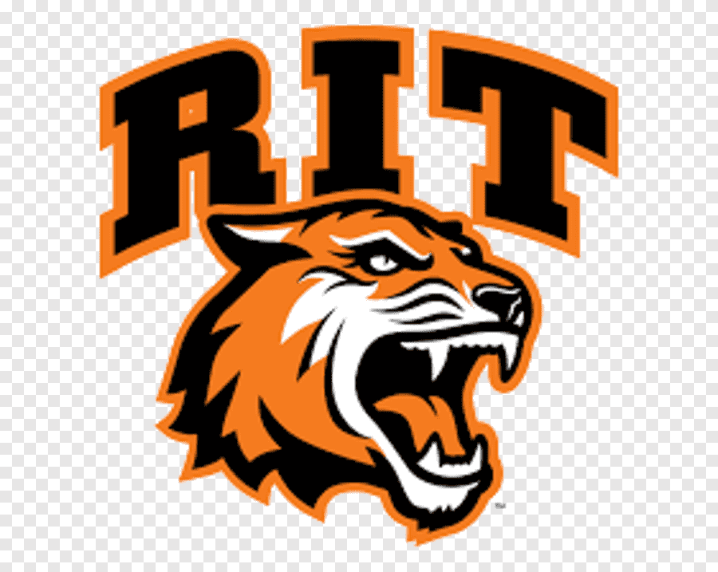
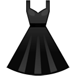

    <h1 align="center">Hello there! </h1> 

    
    
    

I'm Catherine!  I am currently an Azure DevOps software engineer at  .  I usually call myself a backend developer, but I have experience across the stack.

##   Get to Know Me
- Graduate of  with a B.S. in Software Engineering

- Proud native of 

- Loves Disney Parks  

- Always drinking lots of coffee!  

- Plant mom  

- Collects vintage clothes  

- Unironically loves Clippy  

##  Tech and Tools 

##  Currently Coding To...

##   GitHub Stats

<!--
**CatherineOsadciw/CatherineOsadciw** is a ✨ _special_ ✨ repository because its `README.md` (this file) appears on your GitHub profile.

Here are some ideas to get you started:

- 🔭 I’m currently working on ...
- 🌱 I’m currently learning ...
- 👯 I’m looking to collaborate on ...
- 🤔 I’m looking for help with ...
- 💬 Ask me about ...
- 📫 How to reach me: ...
- 😄 Pronouns: ...
- ⚡ Fun fact: ...
-->
